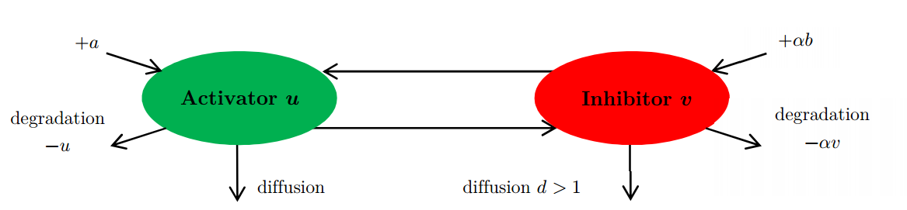
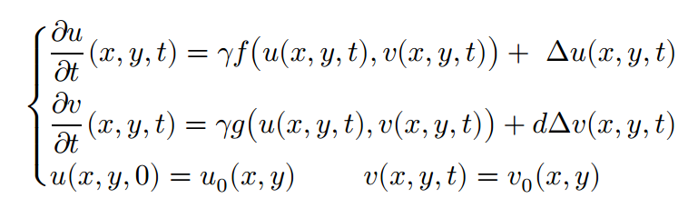
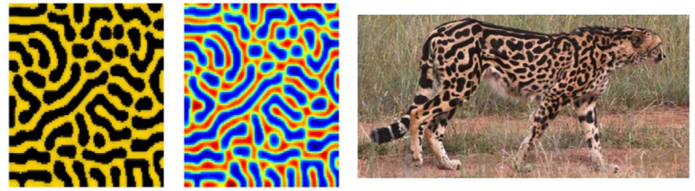
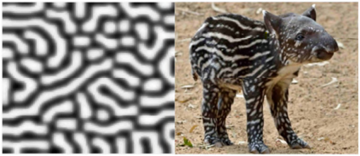
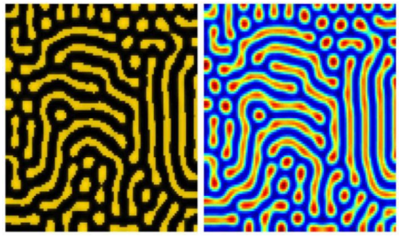
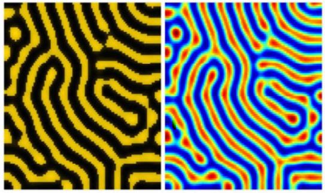

# Turing's Morphogenesis
Matlab implementation of a solver for time-dependent partial differential equations with Neumann boundary conditions. More specifically, this code has been applied to the reaction-diffusion equations from Turing's Morphogenesis model to obtain patterns observed in animal coatings. This repository contains the MATLAB implementation of these experiments and a pdf report. 

## Problem
For animal coat pattern formation, we will use a reaction diffusion model with two morphogens that are involved in production (or non-production) of melanin by melanocytes : oxygen substrate and uricase enzymes. They respectively act as activator and inhibitor in chemical reactions that rule melanin production.

<!-- The equation deriving from the above-described model is given below (more details are given in the report)

 -->

## Results
Using sets of parameters that are given in Murray’s <i>Mathematical Biology</i>, simulations showed results that strongly resemble well-known patterns observed in animal coatings. Here are some of them.

#### The cheetah

#### The tapir

### Unknown patterns
Some sets of parameters lead to stable states with obvious patterns even though they don't resemble any well-known animal coating. 

